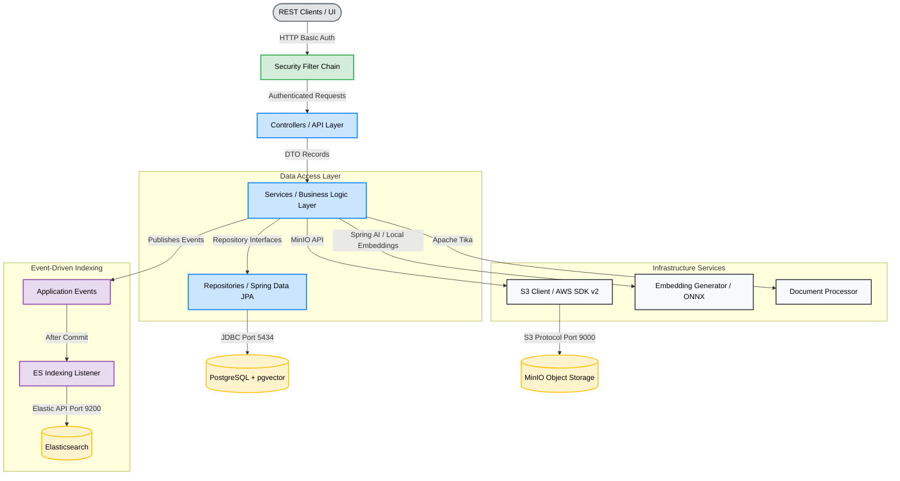
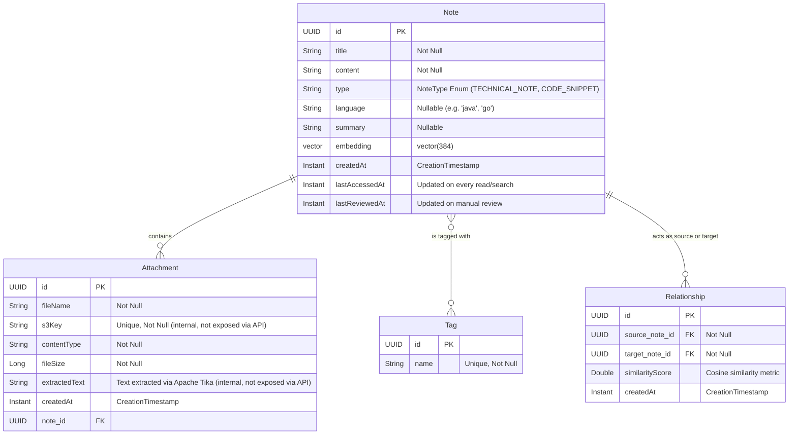

# Architecture Documentation - Cognitive Vault

This document provides a detailed overview of the system architecture, design patterns, components, and data models of the **Cognitive Vault** application.

---

## 1. System Overview

Cognitive Vault is a personal knowledge management platform designed to store technical notes, code snippets, and files. It goes beyond traditional note-taking by dynamically calculating semantic relationships between notes, automatically suggesting spaced repetition study reviews, and providing a hybrid search experience.

The system utilizes a hybrid storage and retrieval approach:
1. **Frontend (React/Vite):** A modern, component-based Single Page Application providing a dashboard, Markdown live-preview editors, concurrent file uploaders, and interactive data visualization (Recharts).
2. **Relational + Vector Database (PostgreSQL with pgvector):** Stores note metadata, tags, relationships, and vector embeddings (384-dimension) generated for semantic similarity searches.
3. **Object Storage (MinIO / S3):** Stores raw attachments (PDFs, images, TXT files).
4. **Full-Text Search Engine (Elasticsearch):** Indexes raw text of attachments and notes to support fast keyword searching.
5. **Local Embedding Model (ONNX):** Generates 384-dimension vector embeddings locally via Spring AI using the `all-MiniLM-L6-v2` model, with no external API calls.
6. **Document Processing (Apache Tika):** Extracts textual content from rich document formats (PDF, DOCX, etc.) to feed both full-text and semantic search pipelines.

---

## 2. Component Architecture

The application is structured into a clean layered architecture with event-driven decoupling between the primary data store and the search engine:

### Layer Responsibilities
- **Security Filter Chain:** HTTP Basic authentication via Spring Security. Stateless sessions (no cookies), CSRF disabled. Credentials are externalized via environment variables. Health endpoint remains public.
- **Controllers:** Expose standard REST endpoints, enforce Bean Validation on incoming payloads (`@Valid`, `@Validated`, `@NotBlank`, `@Min`, `@Max`), translate requests into DTO records, and return standard JSON responses with precise HTTP statuses.
- **Services:** Coordinate business rules, orchestrate transactions, resolve dependencies (such as tag management), perform file content extractions via Apache Tika, trigger relationship calculations, manage the spaced repetition decay logic, and publish indexing events.
- **Event System:** Services publish `NoteIndexRequestedEvent` / `NoteUnindexRequestedEvent` within the transaction. A `@TransactionalEventListener(AFTER_COMMIT)` listener processes them only after the database commit succeeds, decoupling Elasticsearch availability from write operations.
- **Repositories:** Standard Spring Data JPA interfaces. Includes native queries utilizing PostgreSQL extension operators (such as `<=>` cosine distance) to perform vector semantic lookups and JPQL queries for the review decay engine.
- **Utilities (`NoteMapper`, `VectorUtils`):** Shared utility classes that centralize common operations (entity-to-DTO mapping, float array to pgvector string conversion) to eliminate duplication across services.

---

## 3. Data Model

The relational schema is mapped via Hibernate and initialized with pgvector configurations.

---

## 4. Key Design Patterns & Technical Decisions

### 1. Vector Mapping with JPA
Since PostgreSQL's `vector` is a specialized type, JPA lacks direct mapping. The `Note` entity uses `@ColumnTransformer(write = "CAST(? AS vector)")` on the `float[]` field to handle the cast at persistence time. A `VectorUtils` utility centralizes the string serialization (`"[0.1,0.2,...]"`) for native queries.

### 2. Isolation of DTOs
Entities are strictly kept internal to the database and business logic layers. Data transferred to and from API clients uses immutable Java `record` types (`NoteRequest`, `NoteResponse`, `AttachmentResponse`). The `AttachmentResponse` intentionally omits internal fields (`s3Key`, `extractedText`) to avoid leaking infrastructure details.

### 3. Bean Validation Pipeline
All incoming API requests are validated at the controller layer using Jakarta Bean Validation (`@Valid` + `@NotBlank`, `@NotNull`). The search endpoint additionally uses `@Validated` with `@Min`/`@Max` constraints on the `limit` parameter (capped at 50) to prevent abuse. Structured `400 Bad Request` responses are generated via `GlobalExceptionHandler`.

### 4. Structured Exception Handling
A `@ControllerAdvice` (`GlobalExceptionHandler`) centralizes all error responses:
- `ResourceNotFoundException` → `404 Not Found`
- `IllegalArgumentException` → `400 Bad Request`
- `MethodArgumentNotValidException` → `400 Bad Request` with field-level error details
- `ConstraintViolationException` → `400 Bad Request` with constraint messages
- `HandlerMethodValidationException` → `400 Bad Request` with validation messages
- `MissingServletRequestParameterException` → `400 Bad Request` with parameter name
- `StorageException` → `503 Service Unavailable`
- `Exception` (catch-all) → `500 Internal Server Error`

### 5. Reciprocal Rank Fusion (RRF) for Hybrid Search
The `HybridSearchService` combines two independent result sets — one from pgvector semantic search and one from Elasticsearch full-text — using the RRF formula `1 / (k + rank)` where `k = 60`. Notes appearing in both result sets receive a higher fused score, producing a ranking that captures both semantic intent and keyword relevance.

### 6. Spaced Repetition Decay Engine
The `findNotesNeedingReview` JPQL query implements three independent decay rules:
1. **Never reviewed:** `lastReviewedAt IS NULL AND createdAt < 24h ago`
2. **Accessed since last review:** `lastAccessedAt > lastReviewedAt`
3. **Periodic review:** `lastReviewedAt < 30 days ago`

### 7. Event-Driven Elasticsearch Indexing
Instead of calling Elasticsearch directly within database transactions (which would couple search-engine availability to write operations), services publish lightweight application events (`NoteIndexRequestedEvent`, `NoteUnindexRequestedEvent`). The `NoteDocument` payload is pre-built inside the transaction while lazy associations are still accessible. A `@TransactionalEventListener(phase = AFTER_COMMIT)` listener then performs the actual index/delete, with try/catch resilience — a search outage never blocks note persistence.

### 8. S3 Rollback Compensation
When uploading an attachment, the file is sent to S3 before the database record is committed. To prevent orphaned objects if the transaction rolls back, a `TransactionSynchronization` hook is registered that deletes the uploaded S3 object on `afterCompletion(STATUS_ROLLED_BACK)`. This keeps object storage consistent with the database without requiring distributed transactions.

### 9. Document Processing with Apache Tika
The `DocumentProcessor` service uses a dual-path strategy:
- **Plain text files** (`.txt`, `.md`, `.json`, `text/*`): decoded directly as UTF-8 for maximum speed and fidelity.
- **Rich documents** (PDF and others): delegated to Apache Tika, which detects the format and extracts textual content. Parsing failures degrade gracefully to an empty string without interrupting the upload flow.

### 10. HTTP Basic Authentication
Spring Security is configured with HTTP Basic, stateless sessions, and CSRF disabled (appropriate for a REST API). A single user with credentials externalized via environment variables protects all `/api/**` endpoints, while `/actuator/health` remains public for infrastructure probes.

### 11. Decoupled and Isolated Tests
- **Service Layer Tests:** JUnit 5 + Mockito, mocking repositories and verifying event publication for fast, logic-only validation.
- **Controller Layer Tests:** `@WebMvcTest` + `MockMvc` + `@MockitoBean` + `@AutoConfigureMockMvc(addFilters = false)`, validating routing, serialization, HTTP status codes, Bean Validation, and exception handling in isolation (security filters bypassed to focus on controller logic).
- **Integration Tests:** `@SpringBootTest` + `@Tag("integration")` + Testcontainers (PostgreSQL/pgvector). Excluded from CI by default via Maven Surefire configuration; run locally with Docker.
- **Frontend Tests:** Vitest + React Testing Library, covering component rendering, API service mocking, and user interaction flows.

---

## 5. Architectural Lifecycle Progression
- **Phase 1 (Completed):** Setup database schema, model mappings, and REST API CRUD endpoints for notes/snippets.
- **Phase 2 (Completed):** Implement S3 Attachment storage with local MinIO, including file metadata tracking and text extraction.
- **Phase 3 (Completed):** Integrate Elasticsearch keyword indexing and Hybrid Search with RRF fusion.
- **Phase 4 (Completed):** Auto-link semantically related content via embedding matching, implement Spaced Repetition review engine, and add transparent access auditing.
- **Phase 5 (Completed):** Build React + Vite frontend with a clean Notion-inspired UI (light/dark modes), hybrid search view, and note reader overlay.
- **Phase 6 (Completed):** Note management forms with live Markdown preview, multi-file concurrent upload UI, and Recharts Dashboard.
- **Phase 7 (Completed):** Pending Reviews UI, Full Note List, Edit/Delete flows, global Toasts, related-note navigation, and final UX polish.
- **Phase 8 (Completed):** Security hardening (HTTP Basic auth, Actuator restriction, DTO information hiding), event-driven indexing, S3 rollback compensation, Apache Tika PDF extraction, search parameter validation, CI pipeline stabilization, and comprehensive test suite (67 unit/slice + frontend Vitest).
