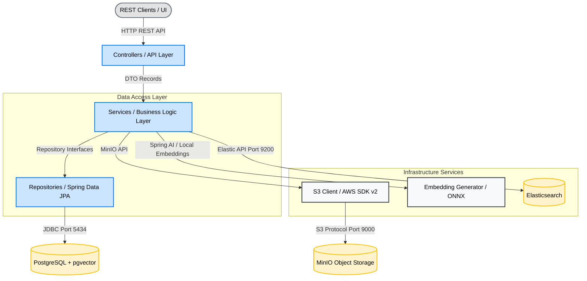
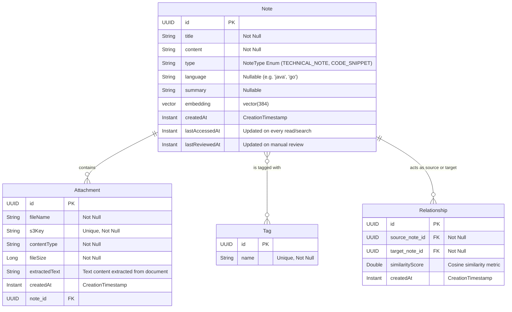

# Architecture Documentation - Cognitive Vault

This document provides a detailed overview of the system architecture, design patterns, components, and data models of the **Cognitive Vault** application.

---

## 1. System Overview

Cognitive Vault is a personal knowledge management platform designed to store technical notes, code snippets, and files. It goes beyond traditional note-taking by dynamically calculating semantic relationships between notes, automatically suggesting spaced repetition study reviews, and providing a hybrid search experience.

The system utilizes a hybrid storage and retrieval approach:
1. **Frontend (React/Vite):** A modern, component-based Single Page Application providing a dashboard, Markdown live-preview editors, concurrent file uploaders, and interactive data visualization (Recharts).
2. **Relational + Vector Database (PostgreSQL with pgvector):** Stores note metadata, tags, relationships, and vector embeddings (384-dimension) generated for semantic similarity searches.
3. **Object Storage (MinIO / S3):** Stores raw attachments (PDFs, images, TXT files).
4. **Full-Text Search Engine (Elasticsearch):** Indexes raw text of attachments and notes to support fast keyword searching.
5. **Local Embedding Model (ONNX):** Generates 384-dimension vector embeddings locally via Spring AI using the `all-MiniLM-L6-v2` model, with no external API calls.

---

## 2. Component Architecture

The application is structured into a clean layered architecture:

### Layer Responsibilities
- **Controllers:** Expose standard REST endpoints, enforce Bean Validation on incoming payloads (`@Valid`), translate requests into DTO records, and return standard JSON responses with precise HTTP statuses.
- **Services:** Coordinate business rules, orchestrate transactions, resolve dependencies (such as tag management), perform file content extractions, trigger relationship calculations, and manage the spaced repetition decay logic.
- **Repositories:** Standard Spring Data JPA interfaces. Includes native queries utilizing PostgreSQL extension operators (such as `<=>` cosine distance) to perform vector semantic lookups and JPQL queries for the review decay engine.
- **Utilities (`NoteMapper`, `VectorUtils`):** Shared utility classes that centralize common operations (entity-to-DTO mapping, float array to pgvector string conversion) to eliminate duplication across services.

---

## 3. Data Model

The relational schema is mapped via Hibernate and initialized with pgvector configurations.

---

## 4. Key Design Patterns & Technical Decisions

### 1. Vector Mapping with JPA
Since PostgreSQL's `vector` is a specialized type, JPA lacks direct mapping. We implemented a custom `VectorConverter` class with `@ColumnTransformer` to cast between a Java `float[]` array and the database's `vector(384)` column.

### 2. Isolation of DTOs
Entities are strictly kept internal to the database and business logic layers. Data transferred to and from API clients uses immutable Java `record` types (`NoteRequest` and `NoteResponse`), preventing serialization loops and decoupling API schemas from database refactorings.

### 3. Bean Validation Pipeline
All incoming API requests are validated at the controller layer using Jakarta Bean Validation (`@Valid` + `@NotBlank`, `@NotNull`). This follows Spring's standard validation pipeline, producing structured `400 Bad Request` responses via `GlobalExceptionHandler` before business logic is ever executed.

### 4. Structured Exception Handling
A `@ControllerAdvice` (`GlobalExceptionHandler`) centralizes all error responses:
- `ResourceNotFoundException` → `404 Not Found`
- `IllegalArgumentException` → `400 Bad Request`
- `MethodArgumentNotValidException` → `400 Bad Request` with field-level error details
- `StorageException` → `503 Service Unavailable`
- `Exception` (catch-all) → `500 Internal Server Error`

### 5. Reciprocal Rank Fusion (RRF) for Hybrid Search
The `HybridSearchService` combines two independent result sets — one from pgvector semantic search and one from Elasticsearch full-text — using the RRF formula `1 / (k + rank)` where `k = 60`. Notes appearing in both result sets receive a higher fused score, producing a ranking that captures both semantic intent and keyword relevance.

### 6. Spaced Repetition Decay Engine
The `findNotesNeedingReview` JPQL query implements three independent decay rules:
1. **Never reviewed:** `lastReviewedAt IS NULL AND createdAt < 24h ago`
2. **Accessed since last review:** `lastAccessedAt > lastReviewedAt`
3. **Periodic review:** `lastReviewedAt < 30 days ago`

### 7. Decoupled and Isolated Tests
- **Service Layer Tests:** JUnit 5 + Mockito, mocking repositories for fast, logic-only test validation.
- **Controller Layer Tests:** `@WebMvcTest` + `MockMvc` + `@MockitoBean`, validating routing, serialization, HTTP status codes, Bean Validation, and exception handling in isolation.
- **Integration Tests:** `@SpringBootTest` boots the full Spring context and connects to the active Docker containers automatically.

---

## 5. Architectural Lifecycle Progression
- **Phase 1 (Completed):** Setup database schema, model mappings, and REST API CRUD endpoints for notes/snippets.
- **Phase 2 (Completed):** Implement S3 Attachment storage with local MinIO, including file metadata tracking and text extraction.
- **Phase 3 (Completed):** Integrate Elasticsearch keyword indexing and Hybrid Search with RRF fusion.
- **Phase 4 (Completed):** Auto-link semantically related content via embedding matching, implement Spaced Repetition review engine, and add transparent access auditing.
- **Phase 5 (Completed):** Build React + Vite frontend with glassmorphic dark mode UI, hybrid search view, and note reader overlay.
- **Phase 6 (Completed):** Note management forms with live Markdown preview, multi-file concurrent upload UI, and Recharts Dashboard.
- **Phase 7 (Next):** Pending Reviews UI, Full Note List, Edit/Delete flows, global Toasts, and final UX polish.
- **Phase 8 (Upcoming):** Comprehensive Testing Suite (Frontend Unit Tests via Vitest, UI component tests, and Backend Integration test expansions).
