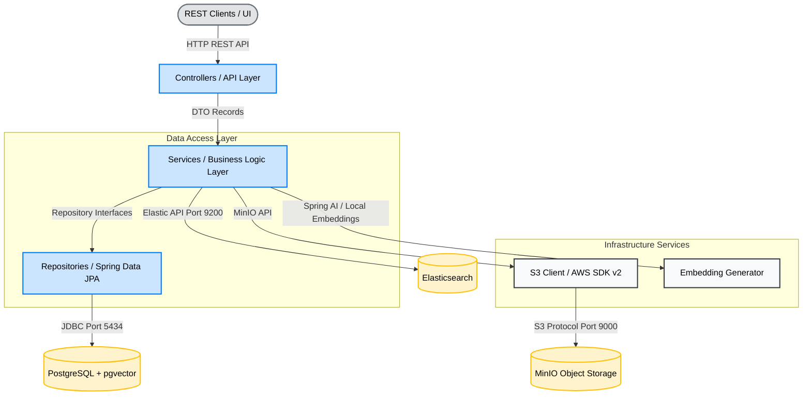
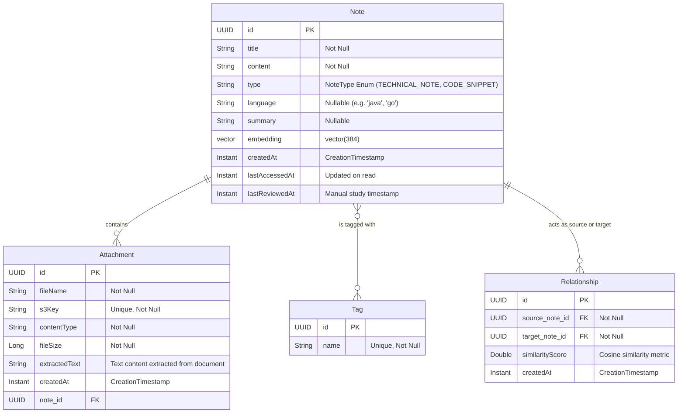

# Architecture Documentation - Cognitive Vault

This document provides a detailed overview of the system architecture, design patterns, components, and data models of the **Cognitive Vault** application.

---

## 1. System Overview

Cognitive Vault is a personal knowledge management platform designed to store technical notes, snippets, and files. It goes beyond traditional note-taking by dynamically calculating semantic relationships between notes and automatically suggesting study reviews.

The system utilizes a hybrid storage and retrieval approach:
1. **Relational + Vector Database (PostgreSQL with pgvector):** Stores note metadata, tags, relationships, and vector embeddings (384-dimension) generated for semantic similarity searches.
2. **Object Storage (MinIO / S3):** Stores raw attachments (PDFs, images, TXT files).
3. **Full-Text Search Engine (Elasticsearch):** Indexes raw text of attachments and notes to support fast keyword searching.

---

## 2. Component Architecture

The application is structured into a clean layered architecture:

### Layer Responsibilities
- **Controllers:** Expose standard REST endpoints, validate input payloads, translate requests into DTO records, and return standard JSON responses with precise HTTP statuses.
- **Services:** Coordinate business rules, orchestrate transactions, resolve dependencies (such as tag management), perform file content extractions, and trigger relationship calculations.
- **Repositories:** Standard Spring Data JPA interfaces. Includes native queries utilizing PostgreSQL extension operators (such as `<=>` cosine distance) to perform vector semantic lookups.

---

## 3. Data Model

The relational schema is mapped via Hibernate and initialized with pgvector configurations.

---

## 4. Key Design Patterns & Technical Decisions

### 1. Vector Mapping with JPA
Since PostgreSQL's `vector` is a specialized type, JPA lacks direct mapping. We implemented a custom `VectorConverter` class extending `AttributeConverter<float[], String>`. 
- **Java representation:** A native `float[]` array.
- **Database representation:** A string format `[v1,v2,v3,...]` which PostgreSQL implicitly casts to a `vector`.

### 2. Isolation of DTOs
Entities are strictly kept internal to the database and business logic layers. Data transferred to and from API clients uses immutable Java `record` types (`NoteRequest` and `NoteResponse`), preventing serialization loops and decoupling API schemas from database refactorings.

### 3. Decoupled and Isolated Tests
- **Service Layer Tests:** Built with JUnit 5 and Mockito, mocking the database/repositories to ensure blazing fast, logic-only test validation.
- **Controller Layer Tests:** Utilizes `@WebMvcTest` with `MockMvc` and `@MockitoBean`, validating routing, serialization, HTTP status codes, and exceptions in isolation without booting the database context.
- **Integration Tests:** Boots the entire Spring context (`@SpringBootTest`) and utilizes the Spring Boot Docker Compose integration to connect to the active local PostgreSQL database container automatically.

---

## 5. Architectural Lifecycle Progression
- **Phase 1 (Completed):** Setup database schema, model mappings, and REST API CRUD endpoints for notes/snippets.
- **Phase 2 (Next):** Implement S3 Attachment storage with local MinIO, including file metadata tracking.
- **Phase 3 (Upcoming):** Integrate Elasticsearch keyword indexing for note search.
- **Phase 4 (Upcoming):** Auto-link semantically related content via embedding matching and calculate review queues.
